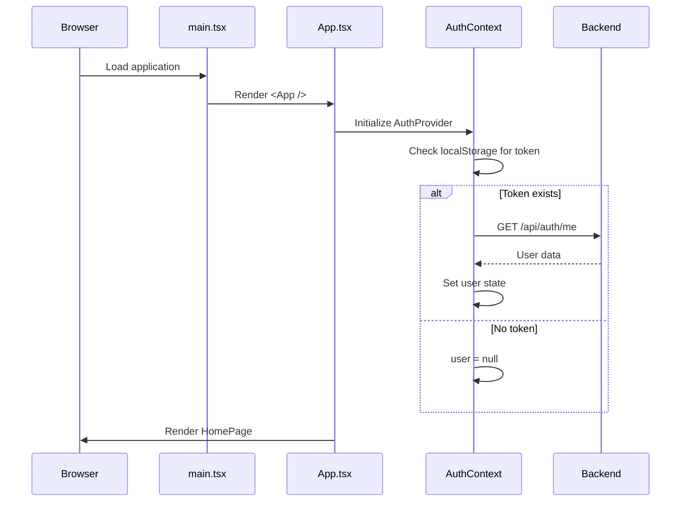
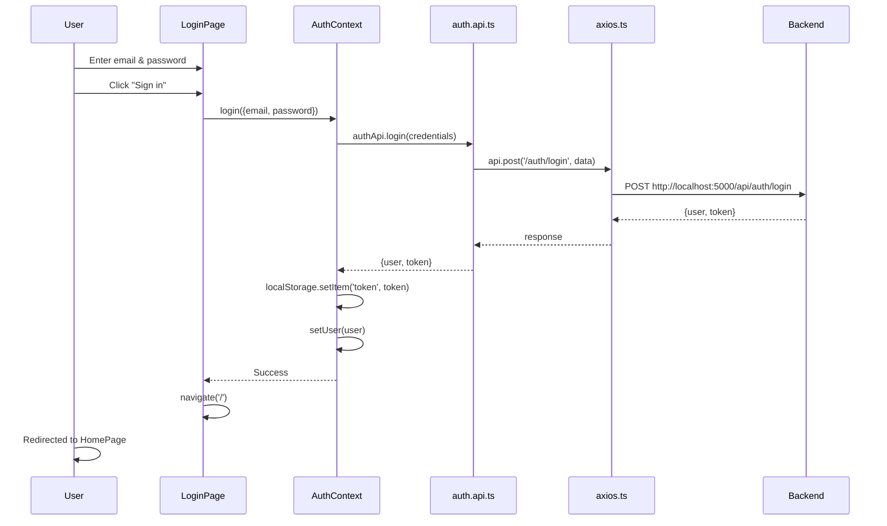
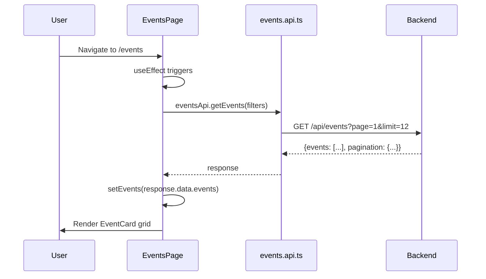
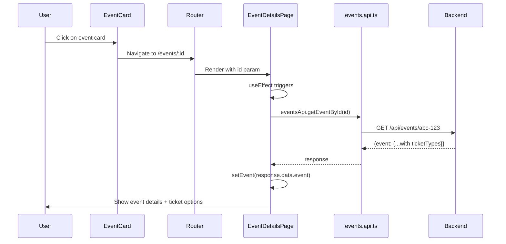
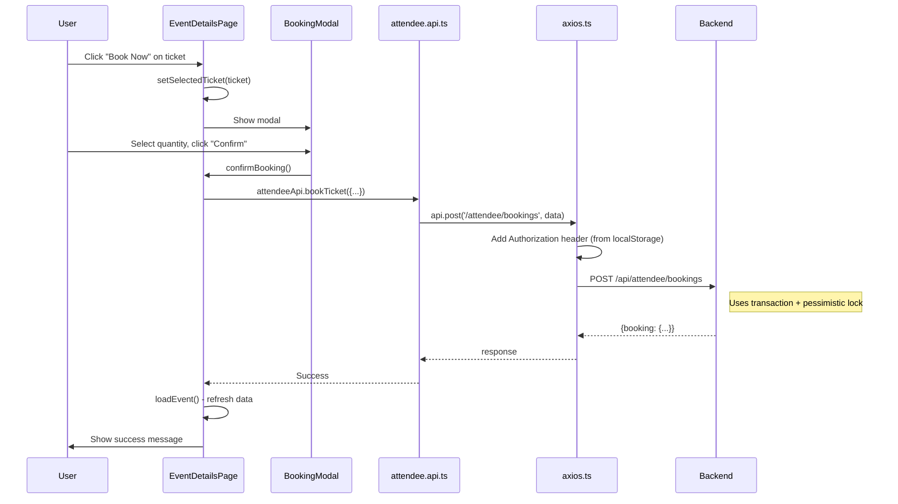

# Frontend-Backend Flow Documentation

This document explains how your Event Management System works from the **user's first visit** to **booking a ticket**. Each section walks through a complete flow with code references.

---

## Table of Contents
1. [Architecture Overview](#architecture-overview)
2. [Example 1: Application Startup](#example-1-application-startup)
3. [Example 2: Login Flow](#example-2-login-flow)
4. [Example 3: Browse Events → Click Event → Book Ticket](#example-3-browse-events--click-event--book-ticket)

---

## Architecture Overview

```
┌─────────────────────────────────────────────────────────────────┐
│                         FRONTEND                                │
│  ┌──────────┐    ┌──────────────┐    ┌────────────────────┐    │
│  │  Pages   │───▶│   Contexts   │───▶│   API Layer        │    │
│  │ (React)  │    │ (State Mgmt) │    │ (axios wrapper)    │    │
│  └──────────┘    └──────────────┘    └─────────┬──────────┘    │
│                                                 │               │
└─────────────────────────────────────────────────┼───────────────┘
                                                  │ HTTP/REST
                                                  ▼
┌─────────────────────────────────────────────────────────────────┐
│                         BACKEND                                 │
│  ┌──────────┐    ┌──────────────┐    ┌────────────────────┐    │
│  │  Routes  │───▶│ Controllers  │───▶│   Database         │    │
│  │          │    │              │    │  (PostgreSQL)      │    │
│  └──────────┘    └──────────────┘    └────────────────────┘    │
└─────────────────────────────────────────────────────────────────┘
```

### Key Files & Their Purpose

| File | Purpose |
|------|---------|
| `main.tsx` | Entry point - renders `<App />` |
| `App.tsx` | Routing + wraps app in `AuthProvider` |
| `contexts/AuthContext.tsx` | Global state for user & token |
| `api/axios.ts` | Axios instance with interceptors |
| `api/*.api.ts` | API functions for each module |
| `pages/*` | React components for each route |

---

## Example 1: Application Startup

**Scenario**: User opens `http://localhost:5173` in browser

### Step-by-Step Flow



### Code Walkthrough

#### Step 1: Entry Point (`main.tsx`)
```tsx
// main.tsx - THE VERY FIRST FILE THAT RUNS
ReactDOM.createRoot(document.getElementById('root')!).render(
  <React.StrictMode>
    <App />          // ← Renders the main App component
  </React.StrictMode>,
)
```

#### Step 2: App Component (`App.tsx`)
```tsx
// App.tsx - Sets up routing and global context
const App: React.FC = () => {
  return (
    <BrowserRouter>
      <AuthProvider>          {/* ← AuthContext wraps ENTIRE app */}
        <AppRoutes />         {/* ← All routes defined here */}
        <Chatbot />
      </AuthProvider>
    </BrowserRouter>
  );
};
```

#### Step 3: AuthContext Initializes (`AuthContext.tsx`)
```tsx
export const AuthProvider: React.FC<{ children: ReactNode }> = ({ children }) => {
    // ① Check localStorage for existing token
    const [token, setToken] = useState<string | null>(localStorage.getItem('token'));
    const [user, setUser] = useState<User | null>(null);
    const [loading, setLoading] = useState<boolean>(true);

    // ② When app loads, if token exists, fetch user data
    useEffect(() => {
        const loadUser = async () => {
            if (token) {
                try {
                    // ③ Call backend to get current user
                    const response = await authApi.getCurrentUser();
                    setUser(response.data.user);
                } catch (error) {
                    // Token invalid - clear it
                    localStorage.removeItem('token');
                    setToken(null);
                }
            }
            setLoading(false);
        };
        loadUser();
    }, [token]);

    // ... provides: user, token, login, logout, register functions
};
```

### What User Sees
- If **no token**: HomePage loads, navbar shows "Login" and "Register"
- If **token exists**: HomePage loads, navbar shows user's name and dashboard link

---

## Example 2: Login Flow

**Scenario**: User clicks Login → Enters email/password → Submits

### Step-by-Step Flow



### Code Walkthrough

#### Step 1: LoginPage Form Submit (`LoginPage.tsx`)
```tsx
const LoginPage: React.FC = () => {
    const [email, setEmail] = useState('');
    const [password, setPassword] = useState('');
    const { login } = useAuth();           // ← Get login function from Context
    const navigate = useNavigate();

    const handleSubmit = async (e: React.FormEvent) => {
        e.preventDefault();
        try {
            await login({ email, password });   // ① Call AuthContext's login
            navigate('/');                      // ② On success, redirect to home
        } catch (err: any) {
            setError('Failed to login');
        }
    };

    return (
        <Form onSubmit={handleSubmit}>
            <Form.Control type="email" value={email} onChange={...} />
            <Form.Control type="password" value={password} onChange={...} />
            <Button type="submit">Sign in</Button>
        </Form>
    );
};
```

#### Step 2: AuthContext login() (`AuthContext.tsx`)
```tsx
const login = async (credentials: LoginCredentials) => {
    // ① Call the API
    const response = await authApi.login(credentials);
    const { user: userData, token: userToken } = response.data;

    // ② Store token in browser (persists across refreshes)
    localStorage.setItem('token', userToken);

    // ③ Update React state (updates UI immediately)
    setToken(userToken);
    setUser(userData);
};
```

#### Step 3: API Layer (`auth.api.ts`)
```tsx
export const authApi = {
    login: async (credentials: LoginCredentials) => {
        const response = await api.post('/auth/login', credentials);
        return response.data;
    },
};
```

#### Step 4: Axios Request (`axios.ts`)
```tsx
const api = axios.create({
    baseURL: 'http://localhost:5000/api',
});

// Request interceptor - automatically adds token to ALL requests
api.interceptors.request.use((config) => {
    const token = localStorage.getItem('token');
    if (token) {
        config.headers.Authorization = `Bearer ${token}`;
    }
    return config;
});
```

#### Step 5: Backend Response
```json
// Backend returns:
{
    "success": true,
    "data": {
        "user": {
            "id": "uuid-123",
            "email": "john@example.com",
            "firstName": "John",
            "lastName": "Doe",
            "role": "attendee"
        },
        "token": "eyJhbGciOiJIUzI1NiIsInR5cCI6IkpXVCJ9..."
    }
}
```

### Data Storage Summary

| Data | Where Stored | Why |
|------|--------------|-----|
| Token | `localStorage` | Persists across page refreshes |
| User object | `AuthContext` state | React needs it for re-renders |
| Token (in requests) | `Authorization` header | Backend verifies each request |

---

## Example 3: Browse Events → Click Event → Book Ticket

**Scenario**: User navigates to Events page → Clicks on event card → Books a ticket

This is the **most complex flow** with multiple API calls and state updates.

---

### Part A: Loading Events Page



#### Code: EventsPage.tsx
```tsx
const EventsPage: React.FC = () => {
    // ① State to store events AND filters
    const [events, setEvents] = useState<EventType[]>([]);
    const [filters, setFilters] = useState<EventFilters>({
        page: 1,
        limit: 12,
        sortBy: 'date',
        order: 'ASC',
    });

    // ② Fetch events whenever filters change
    useEffect(() => {
        loadEvents();
    }, [filters]);

    const loadEvents = async () => {
        setLoading(true);
        try {
            // ③ Call API with current filters
            const response = await eventsApi.getEvents(filters);

            // ④ Store events in state - triggers re-render
            setEvents(response.data.events);
            setPagination(response.data.pagination);
        } finally {
            setLoading(false);
        }
    };

    return (
        <Row>
            {/* Render each event as a card */}
            {events.map((event) => (
                <Col key={event.id}>
                    <EventCard event={event} />   {/* ← Click leads to Details */}
                </Col>
            ))}
        </Row>
    );
};
```

#### API Call (`events.api.ts`)
```tsx
getEvents: async (filters?: EventFilters) => {
    const params = new URLSearchParams();
    Object.entries(filters).forEach(([key, value]) => {
        if (value) params.append(key, value.toString());
    });
    // GET /api/events?page=1&limit=12&sortBy=date&order=ASC
    const response = await api.get(`/events?${params.toString()}`);
    return response.data;
},
```

---

### Part B: Clicking on Event Card → Event Details Page



#### Code: EventCard navigation (implicit via Link)
```tsx
// EventCard component wraps content in a Link
<Link to={`/events/${event.id}`}>
    <Card>...</Card>
</Link>
```

#### Code: EventDetailsPage.tsx
```tsx
const EventDetailsPage: React.FC = () => {
    // ① Get event ID from URL
    const { id } = useParams<{ id: string }>();

    // ② State for event data
    const [event, setEvent] = useState<EventType | null>(null);

    // ③ Fetch event when component mounts
    useEffect(() => {
        if (id) loadEvent();
    }, [id]);

    const loadEvent = async () => {
        try {
            const response = await eventsApi.getEventById(id!);
            setEvent(response.data.event);  // ← NOW has all details + ticketTypes
        } catch (err) {
            setError('Event not found');
        }
    };

    return (
        <Container>
            <h1>{event.title}</h1>
            <p>{event.description}</p>

            {/* Show ticket types */}
            {event.ticketTypes.map((ticket) => (
                <Card key={ticket.id}>
                    <p>{ticket.name} - ${ticket.price}</p>
                    <Button onClick={() => handleBookTicket(ticket)}>
                        Book Now
                    </Button>
                </Card>
            ))}
        </Container>
    );
};
```

---

### Part C: Booking a Ticket



#### Code: Click "Book Now" Button
```tsx
const handleBookTicket = (ticket: TicketType) => {
    if (!user) {
        alert('Please login to book tickets');
        return;
    }
    setSelectedTicket(ticket);    // ① Store which ticket was clicked
    setQuantity(1);               // ② Default quantity
    setShowBookingModal(true);    // ③ Open the modal
};
```

#### Code: Confirm Booking
```tsx
const confirmBooking = async () => {
    if (!selectedTicket || !event) return;

    // Check if paid ticket → show payment modal first
    if (Number(selectedTicket.price) > 0) {
        setShowBookingModal(false);
        setShowPaymentModal(true);    // ← Payment flow for paid tickets
    } else {
        await doBooking();            // ← Direct booking for free tickets
    }
};

const doBooking = async () => {
    setBookingLoading(true);
    try {
        // ① Call booking API
        await attendeeApi.bookTicket({
            eventId: event.id,
            ticketTypeId: selectedTicket.id,
            quantity,
        });

        // ② Show success
        setBookingSuccess('Booking successful!');

        // ③ Reload event to update ticket counts
        loadEvent();
    } catch (err) {
        setError('Booking failed');
    }
};
```

#### API Call (`attendee.api.ts`)
```tsx
bookTicket: async (data: BookingFormData) => {
    // POST /api/attendee/bookings
    // Body: { eventId, ticketTypeId, quantity }
    // Header: Authorization: Bearer <token>
    const response = await api.post('/attendee/bookings', data);
    return response.data;
},
```

---

## Summary: Where Data is Stored in Frontend

| Data Type | Storage Location | Reason |
|-----------|------------------|--------|
| **Token** | `localStorage` | Persists across page refreshes & browser sessions |
| **User Info** | `AuthContext` state | Available globally, triggers UI updates |
| **Events List** | `EventsPage` local state | Only needed on that page, re-fetched on visit |
| **Single Event** | `EventDetailsPage` local state | Fetched when viewing specific event |
| **Selected Ticket** | `EventDetailsPage` local state | Temporary selection for booking modal |
| **Categories** | `EventsPage` local state | For filter dropdown |

---

## Key Concepts Explained

### 1. **Why Context vs Local State?**
- **Context (`AuthContext`)**: Data needed **everywhere** (user info, login status)
- **Local State (`useState`)**: Data needed **only in that component** (events list, form inputs)

### 2. **Why `useEffect`?**
```tsx
useEffect(() => {
    loadEvents();
}, [filters]);  // ← Runs when 'filters' changes
```
- Runs side effects (API calls) after component renders
- Dependencies array controls WHEN it runs

### 3. **Why localStorage + Context?**
- `localStorage`: Survives page refresh (browser storage)
- `Context`: React doesn't automatically read localStorage on re-render

### 4. **How Token Gets Added to Requests?**
```tsx
// axios.ts - Request Interceptor
api.interceptors.request.use((config) => {
    const token = localStorage.getItem('token');
    if (token) {
        config.headers.Authorization = `Bearer ${token}`;
    }
    return config;
});
```
Every request through `api` automatically includes the token!

---

## Visual Summary

```
┌─────────────────────────────────────────────────────────────────────────┐
│                           USER JOURNEY                                   │
│                                                                          │
│  ① App Opens           ② User Logs In         ③ Browse Events           │
│  ┌─────────────┐       ┌─────────────┐        ┌─────────────┐           │
│  │  main.tsx   │──────▶│ LoginPage   │───────▶│ EventsPage  │           │
│  │    ↓        │       │    ↓        │        │     ↓       │           │
│  │ AuthContext │       │ AuthContext │        │ API call    │           │
│  │ (load user) │       │ (login)     │        │ setEvents() │           │
│  └─────────────┘       └─────────────┘        └─────────────┘           │
│                                                      │                   │
│                                                      ▼                   │
│  ⑤ Booking Complete    ④ Book Ticket          Click Event Card          │
│  ┌─────────────┐       ┌─────────────┐        ┌─────────────┐           │
│  │ Success msg │◀──────│ BookingModal│◀───────│EventDetails │           │
│  │ (UI update) │       │ (API call)  │        │ (API call)  │           │
│  │ Ticket count│       │             │        │ setEvent()  │           │
│  │ refreshed   │       └─────────────┘        └─────────────┘           │
│  └─────────────┘                                                         │
└─────────────────────────────────────────────────────────────────────────┘
```

---

## Interview Quick Reference

**Q: How does data flow from frontend to backend?**
> User action → Component → Context/API file → Axios → Backend → Response → setState → Re-render

**Q: Where is user data stored?**
> Token in `localStorage` (persists), User object in `AuthContext` (React state)

**Q: How does authentication work on protected routes?**
> Axios interceptor reads token from localStorage and adds to every request header. Backend validates token.

**Q: What happens when user clicks "Book Now"?**
> 1. Open modal with ticket details
> 2. User confirms quantity
> 3. POST to `/attendee/bookings` with token
> 4. Backend uses transaction + lock to prevent overbooking
> 5. On success, reload event data to update UI
